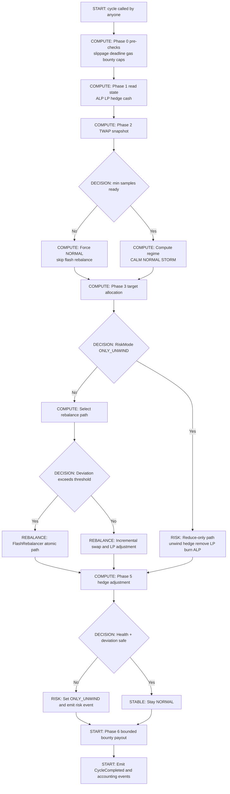

# Self-Driving Yield Engine

<p align="center">
  <strong>An autonomous yield vault that hedges itself</strong>
</p>

<p align="center">
  <a href="https://www.youtube.com/watch?v=rdQyEShM0vs">
    
  </a>
  
  
  
</p>

---

## What is this?

An **autonomous, non-custodial yield engine** for BNB Chain that uses **Aster ALP as both a yield source AND a natural hedge** against LP impermanent loss.

**Key insight**: ALP earns more when markets are volatile — naturally offsetting LP losses during market stress.

```
     CALM MARKET          STORM MARKET
     ┌─────────┐          ┌─────────┐
LP   │  ████   │ High     │  ██     │ IL loss
ALP  │  ███    │ Stable   │  ██████ │ High yield!
     └─────────┘          └─────────┘
     
                    → Auto rebalance ←
```

## Demo Video

**[Watch the 3-minute demo on YouTube](https://www.youtube.com/watch?v=rdQyEShM0vs)**

---

## Key Ideas

- Dual Engine: ALP is both a yield source and a volatility hedge.

- Regime Switching: CALM / NORMAL / STORM allocations shift automatically.

- Permissionless Automation: anyone can call `cycle()` and earn a bounded bounty.

- Atomic Rebalance: Flash Swap rebalances reduce MEV surface.

- No Admin: all parameters are immutable, no multisig or keeper dependency.


## Design Philosophy

- Why: static vaults ignore volatility; this vault adapts while staying non-custodial.

- What: a self-driving engine allocating across ALP, Pancake V2 LP, and 1001x delta hedging.

- How: TWAP-based regime switching, bounded cycle bounty, and atomic flash rebalances.

- Assumptions: protocol ABIs remain stable, on-chain liquidity is sufficient, BSC finality is normal.

- Sustainability: rebalance only when deviation beats costs; gas/bounty caps prevent overtrading.

- Resilience: ONLY_UNWIND risk mode, partial withdrawals, slippage/deadline guards.

Assumptions and mitigations are expanded in `THREAT_MODEL.md` and `ECONOMICS.md`.


## Hackathon Pillars

- Integrate: ALP + Pancake V2 + 1001x adapters.

- Stack: ALP yield + LP fees + hedge funding.

- Automate: permissionless `cycle()` with bounded bounty.

- Protect: TWAP guardrails, flash atomicity, and risk mode safeguards.


## Implementation Notes

- LP rebalancing uses on-chain swaps when the base/quote ratio is off target.

- Flash rebalance computes a borrow amount from LP deviation and caps it to 10% of reserves.

- Flash callbacks repay in the opposite token using on-chain reserves.

- Borrowed flash amounts are excluded from target allocation calculations.

- 1001x position size sums short `qty` from `getPositionsV2(address,address)` and exposes avg entry price.


## Architecture (High-Level)

```
User (USDT)
  -> EngineVault (ERC-4626 style)
     -> ALP Adapter (AsterDEX Earn)
     -> Pancake V2 Adapter (LP + Flash Swap)
     -> 1001x Adapter (Delta Hedge)
     -> VolatilityOracle (TWAP)
     -> WithdrawalQueue (permissionless claim)
```

### `cycle()` Flow (Mermaid + ANSI Legend)

```ansi
\u001b[1;33mSTART\u001b[0m       \u001b[1;36mCOMPUTE\u001b[0m       \u001b[1;34mDECISION\u001b[0m
\u001b[1;31mRISK\u001b[0m        \u001b[1;35mREBALANCE\u001b[0m     \u001b[1;32mSTABLE\u001b[0m
```




## Core Contracts

- `contracts/core/EngineVault.sol`

- `contracts/core/VolatilityOracle.sol`

- `contracts/core/WithdrawalQueue.sol`

- `contracts/adapters/FlashRebalancer.sol`


## Libraries & Interfaces

- `contracts/libs/PancakeOracleLibrary.sol`

- `contracts/libs/PancakeLibrary.sol`

- `contracts/libs/MathLib.sol`

- `contracts/interfaces/IAsterDiamond.sol`


## Docs

- Architecture: `ARCHITECTURE.md`

- Economics: `ECONOMICS.md`

- Hackathon analysis: `docs/ANALYSIS.md`

- On-chain checks: `docs/ONCHAIN_CHECKS.md`

- Slither notes: `docs/SLITHER_NOTES.md`

- Louper Selector Map: `docs/LOUPER_MAP.md`

- Fork demo script: `script/ForkCycleDemo.s.sol`

- Threat model: `THREAT_MODEL.md`

- Demo runbook: `docs/DEMO_SCRIPT.md`

- Demo storyboard: `docs/DEMO_STORYBOARD.md`

- Submission checklist: `docs/SUBMISSION_CHECKLIST.md`


## Quickstart (Foundry)

```bash
forge build
forge test
forge fmt
```

Invariant tests:

```bash
forge test --match-path test/Invariant.t.sol
```

Negative tests:

```bash
forge test --match-path test/EngineVaultRiskMode.t.sol
```


## Fork Tests (BSC)

Set the following environment variable for forked tests:

```bash
export BSC_RPC_URL="https://bsc-dataseed.binance.org/"
forge test
```

Fork suite (A-F):

```bash
forge test --match-path test/ForkSuite.t.sol
```

Adapter fork checks:

```bash
forge test --match-path test/*Adapter.t.sol
```

Optional:

```bash
export BSC_FORK_BLOCK=82710000
```


## On-Chain Verification

```bash
forge script script/ChainChecks.s.sol --rpc-url "https://bsc-dataseed.binance.org/"
cast call 0xcA143Ce32Fe78f1f7019d7d551a6402fC5350c73 "INIT_CODE_PAIR_HASH()(bytes32)" --rpc-url https://bsc-dataseed.binance.org/
```


## Testnet Deployment (BSC)

Deployment script: `script/Deploy.s.sol`

```bash
export BSC_TESTNET_RPC_URL="https://data-seed-prebsc-1-s1.binance.org:8545/"
export PRIVATE_KEY="<your key>"
forge script script/Deploy.s.sol --rpc-url "$BSC_TESTNET_RPC_URL" --broadcast --verify
```

Deployed addresses (fill after broadcast):

- EngineVault: TBD

- VolatilityOracle: TBD

- WithdrawalQueue: TBD

- FlashRebalancer: TBD


## Static Analysis

```bash
slither . --exclude-dependencies --exclude incorrect-equality,timestamp,low-level-calls,naming-convention,cyclomatic-complexity
```

See notes in `docs/SLITHER_NOTES.md`.


## Submission

Use `docs/SUBMISSION_CHECKLIST.md` and `docs/DEMO_SCRIPT.md` for the final submission.


## Status

This repository contains the complete smart contract suite, test coverage, and documentation for the Self-Driving Yield Engine. All tests pass locally. Fork suite A-F validates on-chain integrations.
