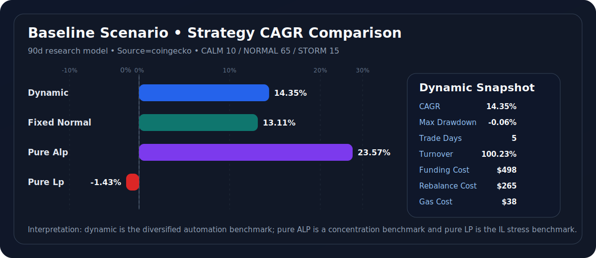
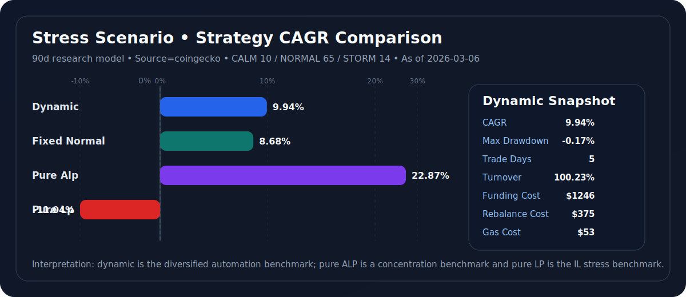
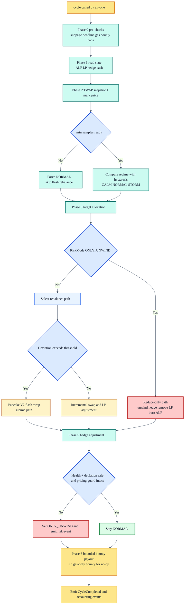

# Self-Driving Yield Engine

<p align="center">
  <strong>An autonomous yield vault that hedges itself</strong>
</p>

<p align="center">
  <a href="https://www.youtube.com/watch?v=rdQyEShM0vs">
    
  </a>
  
  
  
</p>

---

## What is this?

An **autonomous, non-custodial yield engine** for BNB Chain that uses **Aster ALP as both a yield source AND a natural hedge** against LP impermanent loss.

**Key insight**: ALP earns more when markets are volatile — naturally offsetting LP losses during market stress.

```
     CALM MARKET          STORM MARKET
     ┌─────────┐          ┌─────────┐
LP   │  ████   │ High     │  ██     │ IL loss
ALP  │  ███    │ Stable   │  ██████ │ High yield!
     └─────────┘          └─────────┘
     
                    → Auto rebalance ←
```

## Demo Video

**[Watch the 3-minute demo on YouTube](https://www.youtube.com/watch?v=rdQyEShM0vs)**

---

## Investor Snapshot

**Research window**: 90 days, `$100k` simulated TVL, CoinGecko BTC path, baseline/stress scenario comparison.

| Scenario | Dynamic CAGR | Dynamic CumRet | Fixed NORMAL CAGR | Pure LP CAGR | Dynamic MaxDD | Dynamic Trade Days |
|---|---:|---:|---:|---:|---:|---:|
| Baseline | 14.35% | 3.36% | 13.11% | -1.43% | -0.06% | 5 |
| Stress | 10.02% | 2.38% | 8.68% | -11.07% | -0.17% | 5 |

Notes:

- `dynamic` is the product strategy.

- `fixed NORMAL` is the static benchmark.

- `pure LP` is the impermanent-loss stress benchmark.

- `pure ALP` remains a useful concentration benchmark, but it is not the target product shape.

### Backtest Charts





---

## Key Ideas

- Dual Engine: ALP is both a yield source and a volatility hedge.

- Regime Switching: CALM / NORMAL / STORM allocations shift automatically.

- Permissionless Automation: anyone can call `cycle()` and earn a bounded bounty.

- Atomic Rebalance: Flash Swap rebalances reduce MEV surface.

- Investor-Grade Hardening: hedge NAV accounting, TWAP-marked valuation, virtual-share anti-inflation, and no-op bounty suppression.

- No Admin: all parameters are immutable, no multisig or keeper dependency.


## Design Philosophy

- Why: static vaults ignore volatility; this vault adapts while staying non-custodial.

- What: a self-driving engine allocating across ALP, Pancake V2 LP, and 1001x delta hedging.

- How: TWAP-marked valuation, hysteresis-based regime switching, bounded cycle bounty, and atomic flash rebalances.

- Assumptions: protocol ABIs remain stable, on-chain liquidity is sufficient, BSC finality is normal.

- Sustainability: rebalance only when deviation beats costs; no-op cycles do not earn gas-only bounty.

- Resilience: ONLY_UNWIND risk mode, partial withdrawals, virtual-share anti-inflation, and deposit price guards.

Assumptions and mitigations are expanded in `THREAT_MODEL.md` and `ECONOMICS.md`.


## Hackathon Pillars

- Integrate: ALP + Pancake V2 + 1001x adapters.

- Stack: ALP yield + LP fees + hedge funding.

- Automate: permissionless `cycle()` with bounded bounty.

- Protect: TWAP guardrails, flash atomicity, and risk mode safeguards.


## Implementation Notes

- LP rebalancing uses on-chain swaps when the base/quote ratio is off target.

- Flash rebalance uses Pancake V2 flash swap callback (`pancakeCall`) for atomicity.

- Flash borrow amount is derived from LP deviation and capped to 10% of `flashPair` base reserves.

- Flash repay is computed from `flashPair` reserves (UniswapV2 formula via `PancakeLibrary.getAmountIn`).

- `flashPair` must be different from the LP pair (`v2Pair`) to avoid the UniswapV2 pair `lock()` reentrancy guard.

- Borrowed flash amounts are excluded from target allocation calculations.

- 1001x position size sums short `qty` from `getPositionsV2(address,address)` and exposes avg entry price.

- Vault NAV now includes hedge account value (`margin + unrealized PnL - accrued fees`) so share pricing, bounty math, and targets are aligned with real capital.

- LP/base valuation prefers oracle TWAP (`mark price`) over raw spot when available.

- Deposit share minting uses virtual assets/shares plus a TWAP-vs-spot guard to reduce ERC-4626-style inflation and mark-to-market manipulation.

- Regime switching now uses hysteresis bands to reduce boundary churn.

- Over-hedged states close only the amount needed to re-enter the delta band instead of force-closing every short.

- Gas reimbursement only activates when the cycle produced profit or executed meaningful control work.


## Investor-Grade Hardening

```
                    +-----------------------------+
                    |  Investor Concern           |
                    +--------------+--------------+
                                   |
          +------------------------+-------------------------+
          |                        |                         |
          v                        v                         v
  +-------+--------+      +--------+--------+      +---------+--------+
  | NAV accuracy   |      | Share fairness  |      | Keeper alignment |
  +-------+--------+      +--------+--------+      +---------+--------+
          |                        |                         |
          v                        v                         v
  Hedge margin/PnL/fees    Virtual shares +         No-op cycles do not
  included in NAV          price-deviation guard    earn gas-only bounty
          |
          v
  Better accounting for target weights, bounty, and redemptions
```

- **Accurate NAV**: `totalAssets()` includes hedge account value, not just ALP, LP, and idle cash.

- **Safer Share Pricing**: deposits use virtual assets/shares and revert when TWAP vs spot deviation exceeds the pricing guard.

- **More Stable Control Loop**: regime changes use hysteresis and hedge reduction closes only what is needed.

- **Cleaner Incentives**: keepers no longer farm gas-only bounty from empty no-op cycles.


## Architecture (High-Level)

```
User (USDT)
  -> EngineVault (ERC-4626 style)
     -> ALP Adapter (AsterDEX Earn)
     -> Pancake V2 Adapter (LP + Flash Swap)
     -> 1001x Adapter (Delta Hedge)
     -> VolatilityOracle (TWAP)
     -> WithdrawalQueue (permissionless claim)
```

### `cycle()` Flow (Mermaid)


```mermaid
%%{init: {"theme":"base","themeVariables":{"fontFamily":"ui-monospace, SFMono-Regular, Menlo, Monaco, Consolas, monospace","lineColor":"#475569","primaryColor":"#e8f3ff","primaryBorderColor":"#2563eb","primaryTextColor":"#0f172a"}}}%%
flowchart TD
  A[cycle called by anyone] --> B[Phase 0 pre-checks<br/>slippage deadline gas bounty caps]
  B --> C[Phase 1 read state<br/>ALP LP hedge cash]
  C --> D[Phase 2 TWAP snapshot + mark price]
  D --> E{min samples ready}
  E -->|No| F[Force NORMAL<br/>skip flash rebalance]
  E -->|Yes| G[Compute regime with hysteresis<br/>CALM NORMAL STORM]
  F --> H[Phase 3 target allocation]
  G --> H
  H --> I{RiskMode ONLY_UNWIND}
  I -->|Yes| J[Reduce-only path<br/>unwind hedge remove LP burn ALP]
  I -->|No| K[Select rebalance path]
  K --> L{Deviation exceeds threshold}
  L -->|Yes| M[Pancake V2 flash swap<br/>atomic path]
  L -->|No| N[Incremental swap and LP adjustment]
  M --> O[Phase 5 hedge adjustment]
  N --> O
  J --> O
  O --> P{Health + deviation safe<br/>and pricing guard intact}
  P -->|No| Q[Set ONLY_UNWIND and emit risk event]
  P -->|Yes| R[Stay NORMAL]
  Q --> S[Phase 6 bounded bounty payout<br/>no gas-only bounty for no-op]
  R --> S
  S --> T[Emit CycleCompleted and accounting events]

  classDef start fill:#fde68a,stroke:#d97706,color:#111827,stroke-width:2px
  classDef compute fill:#ccfbf1,stroke:#0f766e,color:#0f172a,stroke-width:1.8px
  classDef decision fill:#dbeafe,stroke:#1d4ed8,color:#0f172a,stroke-width:1.8px
  classDef risk fill:#fecaca,stroke:#b91c1c,color:#111827,stroke-width:1.8px
  classDef rebalance fill:#fef3c7,stroke:#b45309,color:#111827,stroke-width:1.8px
  classDef stable fill:#dcfce7,stroke:#15803d,color:#111827,stroke-width:1.8px

  class A,S,T start
  class B,C,D,F,G,H,O compute
  class E,I,L,P decision
  class J,Q risk
  class M,N rebalance
  class R stable
```


## Core Contracts

- `contracts/core/EngineVault.sol`

- `contracts/core/VolatilityOracle.sol`

- `contracts/core/WithdrawalQueue.sol`


## Libraries & Interfaces

- `contracts/libs/PancakeOracleLibrary.sol`

- `contracts/libs/PancakeLibrary.sol`

- `contracts/libs/MathLib.sol`

- `contracts/interfaces/IAsterDiamond.sol`


## Docs

- Architecture: `ARCHITECTURE.md`

- Economics: `ECONOMICS.md`

- Research backtest: `scripts/backtest.py --compare-scenarios`

- Hackathon analysis: `docs/ANALYSIS.md`

- On-chain checks: `docs/ONCHAIN_CHECKS.md`

- Slither notes: `docs/SLITHER_NOTES.md`

- Louper Selector Map: `docs/LOUPER_MAP.md`

- Fork demo script: `script/ForkCycleDemo.s.sol`

- Threat model: `THREAT_MODEL.md`

- Demo runbook: `docs/DEMO_SCRIPT.md`

- Demo storyboard: `docs/DEMO_STORYBOARD.md`

- Submission checklist: `docs/SUBMISSION_CHECKLIST.md`


## Quickstart (Foundry)

```bash
forge build
forge test
forge fmt
python scripts/backtest.py --days 90 --tvl 100000 --cycles-per-day 4 --gas-gwei 50 --compare-scenarios
```

Latest local validation: `48/48` tests passing.

Invariant tests:

```bash
forge test --match-path test/Invariant.t.sol
```

Negative tests:

```bash
forge test --match-path test/EngineVaultRiskMode.t.sol
```


## Fork Tests (BSC)

Set the following environment variable for forked tests:

```bash
export BSC_RPC_URL="https://bsc-dataseed.binance.org/"
forge test
```

Fork suite (A-F):

```bash
forge test --match-path test/ForkSuite.t.sol
```

Adapter fork checks:

```bash
forge test --match-path test/*Adapter.t.sol
```

Optional:

```bash
export BSC_FORK_BLOCK=82710000
```


## On-Chain Verification

```bash
forge script script/ChainChecks.s.sol --rpc-url "https://bsc-dataseed.binance.org/"
cast call 0xcA143Ce32Fe78f1f7019d7d551a6402fC5350c73 "INIT_CODE_PAIR_HASH()(bytes32)" --rpc-url https://bsc-dataseed.binance.org/
```


## Testnet Deployment (BSC)

Deployment script: `script/Deploy.s.sol`

```bash
export BSC_TESTNET_RPC_URL="https://data-seed-prebsc-1-s1.binance.org:8545/"
export PRIVATE_KEY="<your key>"
# Optional: separate flash swap pair (must include pairBase). Defaults to BTCB/WBNB if factory+WBNB are set.
export FLASH_PAIR="<pair address>"
forge script script/Deploy.s.sol --rpc-url "$BSC_TESTNET_RPC_URL" --broadcast --verify
```

Deployed addresses (fill after broadcast):

- EngineVault: TBD

- VolatilityOracle: TBD

- WithdrawalQueue: TBD


## Static Analysis

```bash
slither . --exclude-dependencies --exclude incorrect-equality,timestamp,low-level-calls,naming-convention,cyclomatic-complexity
```

See notes in `docs/SLITHER_NOTES.md`.


## Submission

Use `docs/SUBMISSION_CHECKLIST.md` and `docs/DEMO_SCRIPT.md` for the final submission.


## Status

This repository contains the complete smart contract suite, test coverage, and documentation for the Self-Driving Yield Engine. All tests pass locally. Fork suite A-F validates on-chain integrations.
